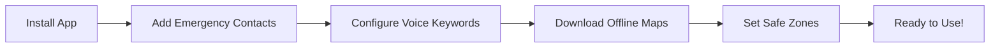

<div align="center">

# 🛡️ SafeHer

### Your Personal Safety Companion

*Empowering women with technology for a safer tomorrow*

[](https://reactjs.org/)
[](https://www.typescriptlang.org/)
[](https://vitejs.dev/)
[](https://tailwindcss.com/)

[Features](#-features) • [Installation](#-installation) • [Usage](#-usage) • [Tech Stack](#-tech-stack)

</div>

---

## 🌟 Overview

**SafeHer** is a comprehensive personal safety application designed with an **offline-first architecture** to ensure reliability when you need it most. Built specifically for women's safety, it combines emergency response, smart navigation, and deception tools to provide peace of mind in any situation.

> **🔒 Privacy First**: No tracking, no data selling. Uses OpenStreetMap instead of Google Maps.

---

## ✨ Features

### 🚨 Emergency Response

<table>
<tr>
<td width="50%">

**SOS Alert System**
- One-tap emergency activation
- Instant SMS to emergency contacts
- Real-time location sharing
- Complete alert history tracking

</td>
<td width="50%">

**Voice-Activated SOS**
- Customizable trigger keywords
- Background voice detection
- Hands-free emergency activation
- Smart keyword matching

</td>
</tr>
</table>

### 📞 Communication & Deception

<table>
<tr>
<td width="50%">

**Fake Call Feature**
- Realistic incoming call screen
- Multiple caller personas
- Custom caller details
- Interactive call interface

</td>
<td width="50%">

**Location Sharing**
- One-tap location broadcast
- SMS integration
- Real-time GPS tracking
- Battery-aware optimization

</td>
</tr>
</table>

### 🗺️ Navigation & Safety

| Feature | Description |
|---------|-------------|
| 🌍 **Offline Maps** | Download areas for use without internet |
| 🛣️ **Safe Routes** | AI-powered route planning avoiding high-risk areas |
| 📍 **Safe Zones** | Define and monitor safe locations with auto-detection |
| 📌 **Custom Pins** | Mark important locations, safe spots, or danger zones |
| 🏥 **Nearby Places** | Quick access to police stations, hospitals, safe havens |
| 🔄 **Route Tracking** | Record and share your journey in real-time |

### 🧠 Smart Features

```
✅ Safe Mode Toggle          ✅ Check-In Timer
✅ Voice Detection           ✅ Notification System
✅ Battery-Aware GPS         ✅ Profile Customization
✅ Offline Authentication    ✅ Service Worker Caching
```

---

## 🎯 Why SafeHer?

| 🌐 Offline-First | 🔐 Privacy Focused | ⚡ Lightning Fast |
|:---:|:---:|:---:|
| Works without internet | No tracking or data selling | Optimized performance |
| Local data storage | OpenStreetMap integration | Service worker caching |
| Offline SMS queueing | Encrypted communications | Battery-aware GPS |

---

## 🚀 Installation

### Prerequisites

- Node.js 16+
- npm or yarn
- Git

### Quick Start

```bash
# Clone the repository
git clone <repository-url>
cd women-safety-app

# Install dependencies
npm install

# Set up environment variables
cp .env.example .env
# Edit .env with your Supabase credentials

# Start development server
npm run dev

# Build for production
npm run build
```

### Environment Variables

Create a `.env` file in the root directory:

```env
VITE_SUPABASE_URL=your_supabase_url
VITE_SUPABASE_ANON_KEY=your_supabase_anon_key
```

---

## 💻 Tech Stack

<div align="center">

### Frontend


### Maps & Location


### Backend & Data


</div>

<details>
<summary><b>📦 Full Dependency List</b></summary>

**Core Libraries:**
- React 18.3 & React DOM
- React Router DOM 6.30
- TypeScript 5.8

**UI Components:**
- Radix UI (Complete component library)
- Shadcn UI
- Lucide React (Icons)
- Sonner (Toasts)

**Maps & Geolocation:**
- Leaflet & React-Leaflet
- Leaflet Geosearch
- Mapbox GL
- @react-google-maps/api

**Data & State:**
- TanStack Query
- Supabase JS Client
- IDB (IndexedDB wrapper)
- React Hook Form + Zod

**Utilities:**
- date-fns
- class-variance-authority
- tailwind-merge
- qrcode.react

</details>

---

## 📱 Usage Guide

### 🎬 First Time Setup



1. **👥 Add Emergency Contacts** - Navigate to Settings → Add 2-3 trusted contacts
2. **🎤 Configure Voice Keywords** - Set custom SOS trigger words (e.g., "help me")
3. **🗺️ Download Offline Maps** - Download frequently visited areas
4. **🏠 Set Safe Zones** - Mark home, workplace, and other safe locations

### 🆘 Emergency Situations

| Action | How to Use | Result |
|--------|-----------|--------|
| **SOS Button** | Hold for 2 seconds | Sends alerts to all emergency contacts |
| **Voice Activation** | Say configured keyword | Auto-triggers SOS with location |
| **Fake Call** | Tap quick action | Receive realistic fake call |
| **Check-In** | Set timer | Alerts sent if you miss check-in |

### 💡 Best Practices

- ✅ Keep app running in background for voice detection
- ✅ Regularly update emergency contacts
- ✅ Test fake call feature to ensure smooth operation
- ✅ Download offline maps before traveling
- ✅ Enable location permissions for accurate tracking

---

## 📂 Project Structure

```
women-safety-app/
│
├── 📁 public/
│   └── sw.js                         # Service worker for offline support
│
├── 📁 src/
│   ├── 📁 components/
│   │   ├── 📁 ui/                    # Reusable UI components (30+ components)
│   │   ├── 📁 auth/                  # Authentication components
│   │   ├── SOSButton.tsx             # Emergency SOS button
│   │   ├── QuickActions.tsx          # Quick action buttons
│   │   ├── FakeCallScreen.tsx        # Fake call interface
│   │   ├── AdvancedOpenStreetMap.tsx # Map with offline support
│   │   └── ...                       # 20+ feature components
│   │
│   ├── 📁 contexts/
│   │   ├── SafetyContext.tsx         # Global safety state
│   │   ├── AuthContext.tsx           # Authentication state
│   │   └── NotificationContext.tsx   # Notification management
│   │
│   ├── 📁 hooks/
│   │   ├── useOfflineSOS.ts          # Offline SOS functionality
│   │   ├── useVoiceDetection.ts      # Voice keyword detection
│   │   ├── useOfflineMaps.ts         # Offline map management
│   │   ├── useSafeRoute.ts           # Safe route planning
│   │   ├── useBatteryAwareGPS.ts     # Optimized GPS tracking
│   │   └── ...                       # 10+ custom hooks
│   │
│   ├── 📁 lib/
│   │   ├── offlineDB.ts              # IndexedDB utilities
│   │   ├── notificationDB.ts         # Notification storage
│   │   ├── serviceWorker.ts          # Service worker helpers
│   │   └── nearbyPlaces.ts           # Places search logic
│   │
│   ├── 📁 pages/
│   │   └── Index.tsx                 # Main dashboard
│   │
│   └── main.tsx                      # App entry point
│
├── 📁 supabase/
│   └── 📁 functions/
│       └── send-sms/                 # Edge function for SMS
│
└── package.json
```

---

## 🛠️ Development

### Available Scripts

| Command | Description |
|---------|-------------|
| `npm run dev` | Start development server with hot reload |
| `npm run build` | Build optimized production bundle |
| `npm run build:dev` | Build in development mode |
| `npm run preview` | Preview production build locally |
| `npm run lint` | Run ESLint for code quality |

### Browser Support

| Browser | Minimum Version |
|---------|----------------|
| Chrome | 90+ ✅ |
| Firefox | 88+ ✅ |
| Safari | 14+ ✅ |
| Edge | 90+ ✅ |

**Required Features:**
- Service Workers
- Geolocation API
- IndexedDB
- Media Recorder API

---

## 🔐 Privacy & Security

<table>
<tr>
<td align="center" width="25%">

### 🚫 No Tracking
Uses OpenStreetMap instead of Google Maps

</td>
<td align="center" width="25%">

### 💾 Local Storage
Sensitive data stored locally with IndexedDB

</td>
<td align="center" width="25%">

### 🔒 Encrypted
Supabase backend with secure authentication

</td>
<td align="center" width="25%">

### 🙅 No Data Selling
Your safety data is never shared

</td>
</tr>
</table>

---

## 🤝 Contributing

We welcome contributions! If you'd like to help improve SafeHer:

1. 🍴 Fork the repository
2. 🌿 Create a feature branch (`git checkout -b feature/AmazingFeature`)
3. 💾 Commit your changes (`git commit -m 'Add some AmazingFeature'`)
4. 📤 Push to the branch (`git push origin feature/AmazingFeature`)
5. 🔀 Open a Pull Request

**Please ensure all privacy and security features remain intact.**

---

## 👨‍💻 Developer

<div align="center">

### Anish Das

[](https://github.com/techanish)
[](https://www.linkedin.com/in/techanish/)
[](https://x.com/techanish001)
[](https://www.instagram.com/techanish/)

*Building technology that makes a difference*

</div>

---

## 📄 License

This project is private and proprietary.

---

## 📞 Support

Having issues or questions? We're here to help!

- 🐛 [Report a Bug](../../issues)
- 💡 [Request a Feature](../../issues)
- 📧 Contact Support

---

<div align="center">

### ⚠️ Important Notice

**This app is a tool to enhance your safety, but should not replace calling emergency services (911, 112, etc.) when in immediate danger.**

---

Made with ❤️ for women's safety

**Star ⭐ this repo if you find it useful!**

</div>
